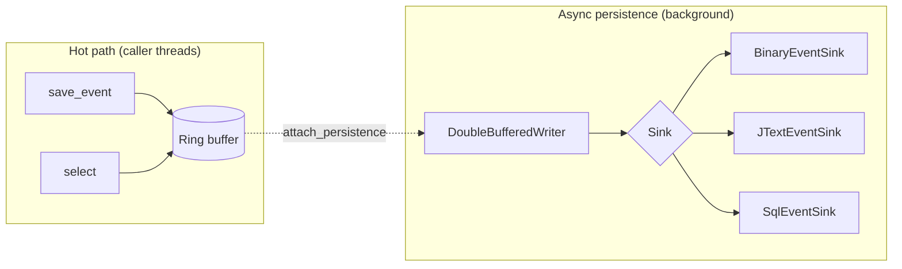
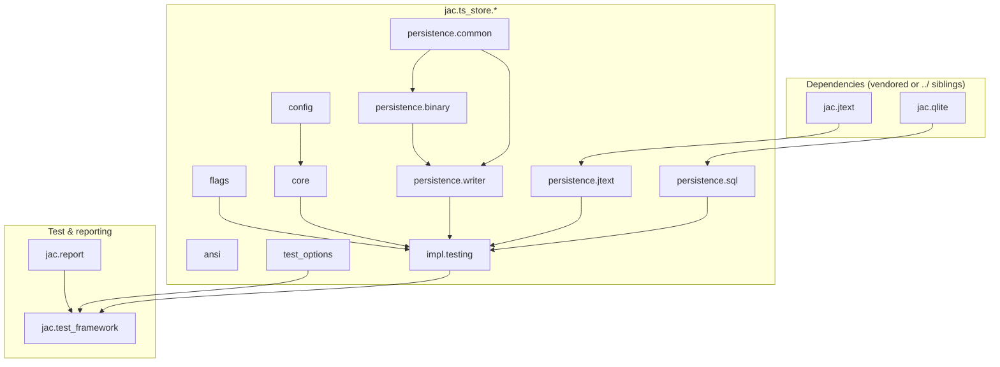

# ts_store — Structure & Architecture

High-level map of how the event buffer, persistence layer, C++23 modules, test matrix, and repo layout fit together.

---

## System overview

`ts_store` is a **thread-safe in-memory event ring** with an optional **asynchronous persistence path**. The design keeps the hot path (`save_event`) fast; durability happens on a background thread via pluggable sinks.



| Layer | Responsibility |
|-------|----------------|
| **Core buffer** | Pre-sized ring per thread; lock-free / low-contention `save_event`; `select(id)` returns `string_view` |
| **Flags** | Single `uint64_t` user + automatic bits ([Doc/ts_store_flag_docs.md](ts_store_flag_docs.md)) |
| **DoubleBufferedWriter** | Swaps front/back buffers; drains to sink without blocking producers |
| **Sinks** | Binary (mmap-friendly), jText (split main/_Ints/_Floats), SQL (optional, via jacQlite) |

Implementation lives in [include/beman/ts_store/ts_store_headers/](../include/beman/ts_store/ts_store_headers/). Application and test code **imports** C++23 modules; `.cppm` files are thin facades over those headers.

---

## C++23 module layers

Modules partition **compile time on one fixed toolchain** — not portability. Change flags on the same machine → only `jac.ts_store.flags` and its consumers rebuild. See [Modules are not for portability](#modules-are-not-for-portability) below.



| Module | CMake target | Typical import |
|--------|--------------|----------------|
| `jac.ts_store.config` | `jac_ts_store_config` | Compile-time `ts_store_config<>` |
| `jac.ts_store.flags` | `jac_ts_store_flags` | `TsStoreFlags` |
| `jac.ts_store.core` | `jac_ts_store_core` | Core store (headers-backed) |
| `jac.ts_store.impl.testing` | `jac_ts_store_impl_testing` | Integrated store + sinks for tests/demos |
| `jac.ts_store.persistence.*` | `jac_ts_store_persistence_*` | Sinks and `DoubleBufferedWriter` |
| `jac.test_framework` | `jac_test_framework` | Matrix runner (`load_test_params`, scenarios) |
| `jac.report` | `jac_report` | Manifest → SQLite + markdown summaries |

Namespace: `jac::ts_store::inline_v001`.

### Modules are not for portability

C++23 modules here are a **local build-speed tool**, not a distribution format. Binary module interfaces (BMIs) and the compiled module graph are tied to a specific **machine, CPU, OS, and compiler**.

**Whenever any of these change, you must rebuild all modules once** (full configure + full matrix build), then you can reuse that build tree for incremental work and testing on *that same* environment:

| Change | Action |
|--------|--------|
| New physical machine | Full module rebuild |
| New CPU / ISA (e.g. `-march` difference) | Full module rebuild |
| New OS or distro | Full module rebuild |
| New compiler or major compiler version (gcc ↔ clang, 14 → 15, etc.) | Full module rebuild |
| Same box, same compiler, editing source | Incremental rebuild (module granularity helps) |

What is in git: `modules/**/*.cppm` and companion sources only. What is **not** portable and must **never** be copied between environments: `.gcm`, `.pcm`, `.ifc`, `.ddi`, `.modmap`, and other scanner/BMI artifacts (all gitignored).

**Workflow on a new environment:** `./scripts/Build FileCheckList.txt --FullRebuild=On --SmokeTest=On` (or equivalent clean cmake + full target list) → run tests from that build dir → on subsequent edits on the *same* host/compiler, ninja reuses BMIs until you change toolchain or pass `--FullRebuild=On`.

---

## Repository layout

```
ts_store/
├── modules/              # C++23 module interfaces (.cppm) + runner .cpp
│   ├── jac.ts_store/     # Store, flags, persistence shims
│   ├── jac.jtext/        # jText module re-exports
│   ├── jac.qlite/        # jacQlite SQLite wrapper
│   ├── jac.test_framework/
│   └── jac.report/
├── include/beman/ts_store/ts_store_headers/   # Implementation headers
├── tests/
│   ├── ts_store_001 … 007/   # TS (threaded) + XS (extra-small) stress binaries
│   ├── ts_store_flags/       # Flags unit test
│   └── test_params.txt       # SIZE, DISK_TYPE, selected tests
├── tools/
│   ├── test_cli/         # ts_test_cli — matrix driver
│   └── jtext_cli/
├── examples/             # Demos and throughput benchmarks
├── scripts/
│   ├── Build             # Primary checklist-driven build + test + promote
│   ├── build_common.sh   # Ninja ≥ 1.11
│   └── promote_summaries.sh
├── vendor/               # jText + jacQlite (vendored clone)
├── test-results/         # Raw logs & artifacts (git-ignored)
└── test-summary/         # Promoted proof (committed)
```

| Path | Notes |
|------|-------|
| [FileCheckList.txt](../FileCheckList.txt) | User-editable run selector: `[x]` = run, `[ ]` = skip (never auto-edited) |
| [FORWARDING.md](../FORWARDING.md) | Checklist build workflow and current status |
| [CMakeLists.txt](../CMakeLists.txt) | Targets, persist options, compiler tuning flags |

---

## Regression / test architecture

The project is evolving into a **regression platform**: every meaningful change should pass the automated matrix before merge.

```mermaid
flowchart LR
  FC[FileCheckList.txt]
  B[scripts/Build]
  CMAKE[cmake + ninja]
  CLI[ts_test_cli]
  RES[test-results/OS_00n/compiler/disk/Smoke|xFull/]
  SUM[test-summary/]

  FC --> B
  B --> CMAKE
  CMAKE --> CLI
  CLI --> RES
  B --> SUM
```

**Matrix dimensions** (per test binary 001–007 TS/XS + `ts_store_flags`):

- **Persist:** binary, jText, SQL, none (in-memory only)
- **Output mode:** on / off (structured side-channel logging)
- **Compiler:** gcc and/or clang (one per checklist row; manifest merges both)

**Sizing** ([tests/test_params.txt](../tests/test_params.txt)):

| `SIZE` | Label | Scope |
|--------|-------|-------|
| `smoke` | `Smoke` | ~100 events/scenario; fast sanity (~113 scenarios/compiler) |
| `full` | `xFull` | Progressive scale; 005/006/007 reach heavy load (~30 min dual on x7k) |

**Result tree** (short names for alignment):

```
test-results/OS_003/gcc/ssd/Smoke/
test-results/OS_003/clang/ssd/Smoke/
  run_manifest.jtext      # machine-readable matrix
  README.md               # navigation hub
  by_test/*.md            # per-binary summaries
  binary_logs/ jText_logs/ sql_logs/ inmem_logs/ unit_logs/
```

OS id (`OS_001`, `OS_002`, …) is auto-detected or overridden; mapping in `test-results/OS_MAP.txt`. Promotion copies lightweight files to mirrored paths under `test-summary/`.

---

## Build & toolchain architecture

`./scripts/Build` walks [FileCheckList.txt](../FileCheckList.txt) top to bottom. Each **`[x]`** row is one **platform + compiler + disk** cycle (`[ ]` rows are skipped; markers are never auto-edited):

1. Transient `build-seq/<platform>-<compiler>/` (removed after success)
2. Full matrix targets built (001–007 TS/XS, flags, `ts_test_cli`, demos)
3. `ts_test_cli run` from build dir (binaries must be cwd-adjacent)
4. `promote_summaries.sh` → `test-summary/`
5. Next `[x]` row in file order, until EOF

| Host | GCC row | Clang row |
|------|---------|-----------|
| Linux Mint 22 | `g++-15` (PPA) | `clang++-20` |
| RHEL 9/10 | `gcc-toolset-15` (`scl`) | system `clang++` (21+ preferred) |

Modules require **Ninja ≥ 1.11**. Treat every new machine / CPU / OS / compiler as a **from-scratch module rebuild**; only then reuse artifacts for testing on that host ([§ Modules are not for portability](#modules-are-not-for-portability)).

Details: [FORWARDING.md](../FORWARDING.md) · Mint toolchains: [linux_mint_gcc15.md](linux_mint_gcc15.md)

---

## Configuration surface

| Knob | Where | Effect |
|------|-------|--------|
| `TS_STORE_ENABLE_JTEXT_PERSIST` | CMake | jText sinks + jText module graph |
| `TS_STORE_ENABLE_SQLITE_PERSIST` | CMake | SQL sink + jacQlite |
| `TS_STORE_JTEXT_MODE` / `JACQLITE_MODE` | CMake | `vendored` vs `reference` (../ siblings) |
| `TS_STORE_GNU_RELEASE_O3` | CMake | GCC `-O3` (off by default on Mint PPA) |
| `TS_STORE_CLANG_LTO` | CMake | Clang thin LTO compile+link (off by default) |
| `SIZE`, `DISK_TYPE`, `001=x`… | test_params.txt | Matrix scope and hardware bucket |

---

## Related documentation

| Doc | Topic |
|-----|-------|
| [README.md](../README.md) | Quick start, dependencies, building |
| [FORWARDING.md](../FORWARDING.md) | Sequential checklist build |
| [Doc/ts_store_flag_docs.md](ts_store_flag_docs.md) | Flag bit layout |
| [Doc/linux_mint_gcc15.md](linux_mint_gcc15.md) | Mint GCC 15 + Clang 20 |
| [DUAL_COMPILER_BUILD.md](../DUAL_COMPILER_BUILD.md) | Legacy dual gcc+clang script |
| [BUILD_ISSUES_AND_FIXES_FOR_OTHER_MACHINE.md](../BUILD_ISSUES_AND_FIXES_FOR_OTHER_MACHINE.md) | New-machine pitfalls |
| [test-summary/README.md](../test-summary/README.md) | Promoted run index |